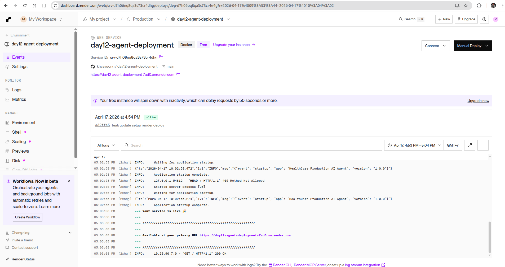
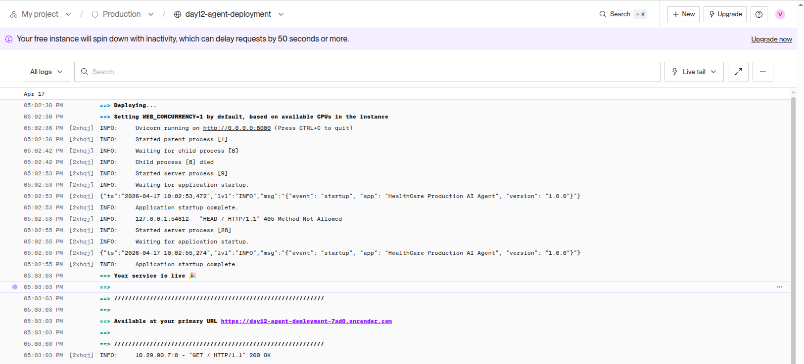
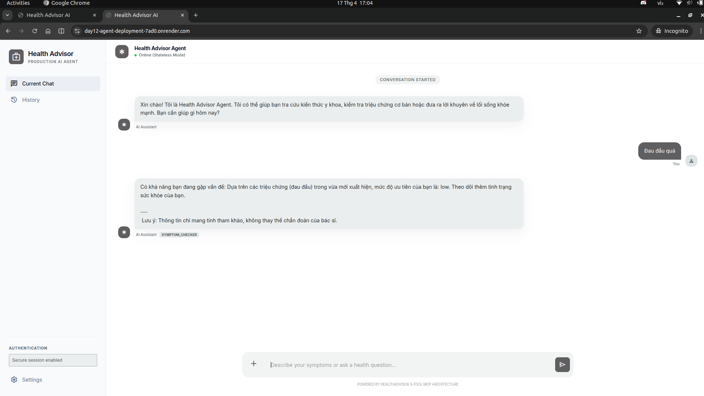
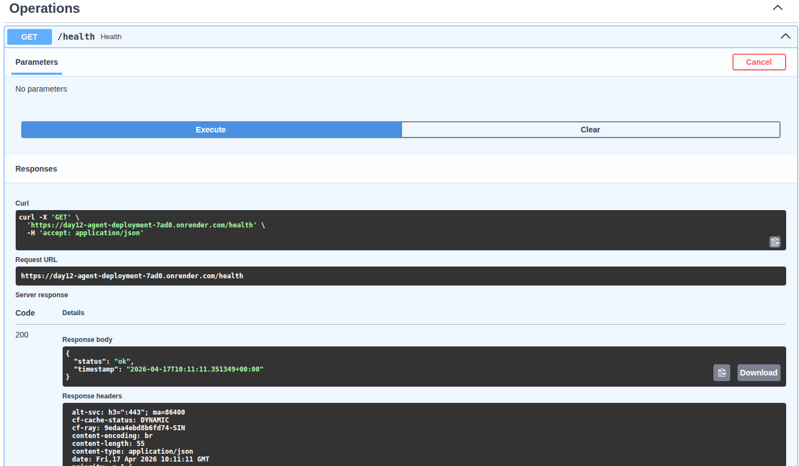
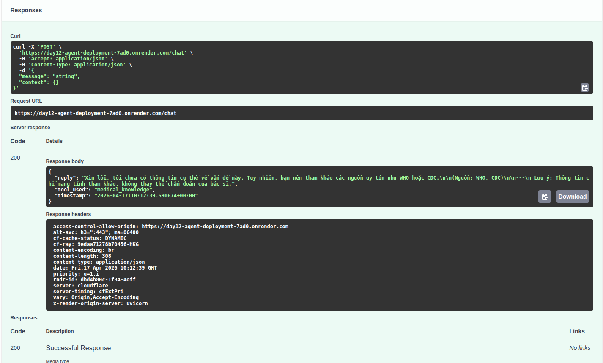

# Deployment Information

## Public URL

`https://day12-agent-deployment-7ad0.onrender.com`

## Platform

Render

## Test Commands

### Health Check

```bash
curl https://your-agent.railway.app/health
# Expected: {"status": "ok"}
```

### API Test (with authentication)

```bash
curl -X POST https://your-agent.railway.app/ask \
  -H "X-API-Key: YOUR_PROD_KEY" \
  -H "Content-Type: application/json" \
  -d '{"question": "Hello"}'
```

## Environment Variables Set


## Screenshots

### Deployment dashboard



### Service running



### Test results



#### Check health



#### Check chat



### Images size

```bash
health_care-agent:latest                                                                 f898b6d46e37        191MB             0B    U
```
