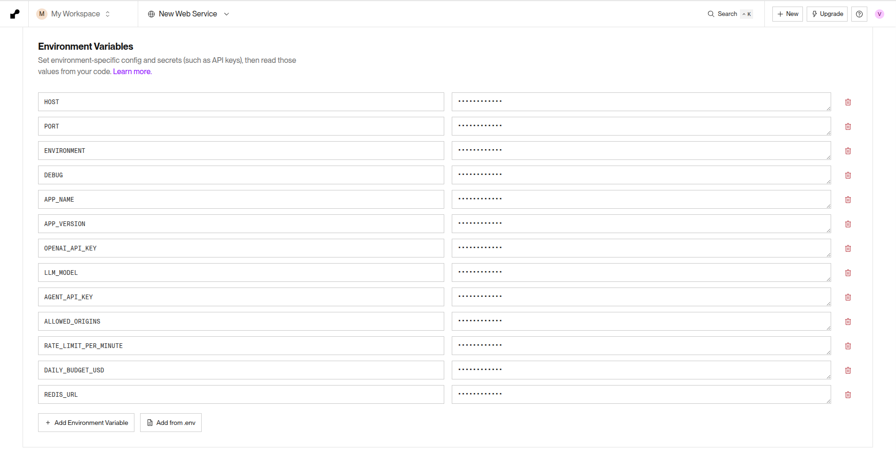
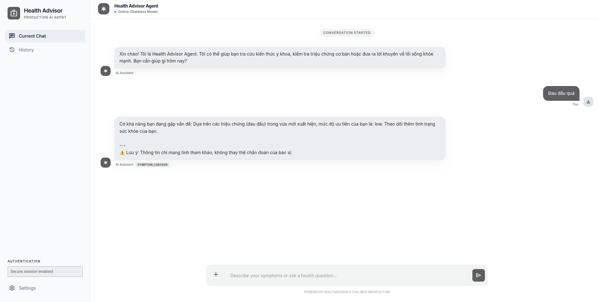
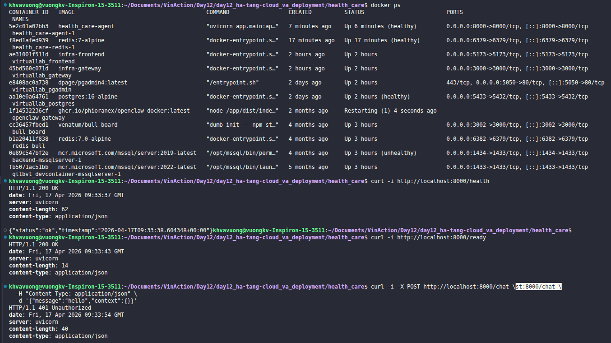
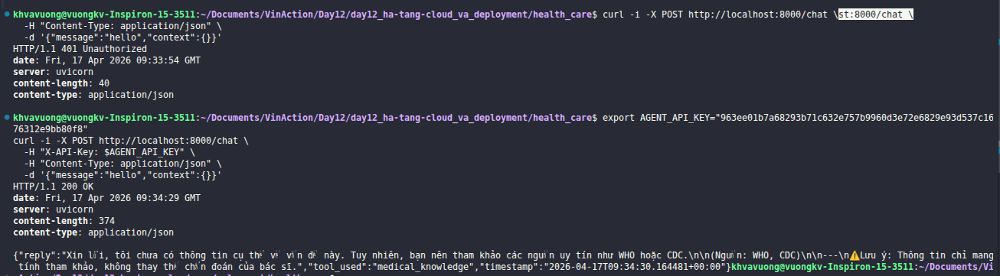
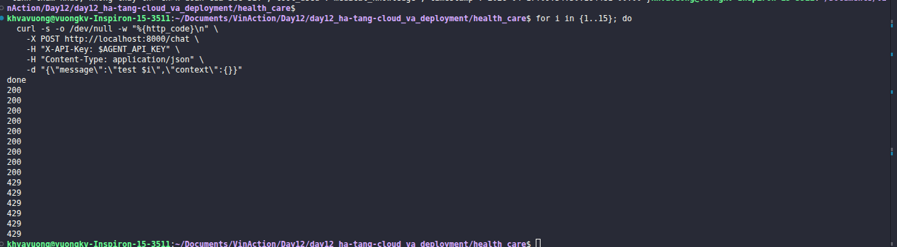

### Enviroment Variable



### Test UI



### Test endpoint

```bash
# health
curl -i http://localhost:8000/health

# ready
curl -i http://localhost:8000/ready

```



### Test auth

```bash
# không key -> 401
curl -i -X POST http://localhost:8000/chat \
  -H "Content-Type: application/json" \
  -d '{"message":"hello","context":{}}'

# có key -> 200
export AGENT_API_KEY="key-here"
curl -i -X POST http://localhost:8000/chat \
  -H "X-API-Key: $AGENT_API_KEY" \
  -H "Content-Type: application/json" \
  -d '{"message":"hello","context":{}}'

```



### Rate limit

```bash
for i in {1..15}; do
  curl -s -o /dev/null -w "%{http_code}\n" \
    -X POST http://localhost:8000/chat \
    -H "X-API-Key: $AGENT_API_KEY" \
    -H "Content-Type: application/json" \
    -d "{\"message\":\"test $i\",\"context\":{}}"
done

```


